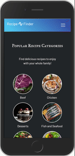

# Recipe-Finder

A react application that uses data from TheMealDB api to allow users to search recipes based on the food category. 

## Technologies Used 

* React.js Library
* JavaScript and JSX
* CSS
* Bootstrap and MDBootstrap
* react-scroll-parallax NPM for parallax effects
* React-transition-group and react-animation-components for animation effects
* TheMealDB API
* Unplash.com for open-sourced images
* AdobeXd

## Wireframe and UI Design
This application utilizes subtle animation effects to create for a better UI / UX through the use of multiple animation packages. The website is also mobile responsive through the use of bootstrap with the addition of MDBootstrap.

THere are some preliminary wireframes from the initial development stage. Wireframes were built using AdobeXd. 

## Contact

If you have any questions, concerns, or comments, please contact me at wandrew8@gmail.com. You can check out more of my work at my personal website [here](http://andrewjohnweiss.com).